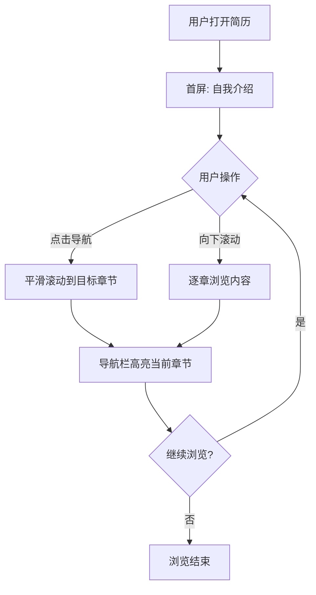

## 1. 产品概述

为即将参加秋招的应届生打造的网页版个人简历，以"杂志编辑风 × 现代专业感"为美学方向，在保持秋招正式感的同时展现年轻人的活力与个性。

- **目标用户**：参加秋招的应届毕业生，以及查看简历的 HR、面试官
- **核心价值**：在众多简历中脱颖而出，既专业又不失个性，提供沉浸式的阅读体验
- **差异化**：摒弃传统简历的表格化排版，采用编辑级版式设计 + 交互式导航 + 滚动动效

## 2. 核心功能

### 2.2 功能模块

1. **自我介绍页**：个人名片、一句话标语、核心标签、社交链接
2. **教育背景页**：学校时间线、专业信息、核心课程、学术亮点
3. **实习经历页**：实习时间线、公司项目卡片、职责与成果
4. **学习探索页**：技能成长、项目探索、学习沉淀、未来展望

### 2.3 页面详情

| 页面名称 | 模块名称 | 功能描述 |
|---------|---------|---------|
| 自我介绍 | 个人名片 | 大字号姓名展示、职位标语、椭圆形头像、社交链接 |
| 自我介绍 | 核心标签 | 关键词标签云，hover 有微动效 |
| 教育背景 | 时间线 | 纵向时间线展示求学经历，节点带年份标记 |
| 教育背景 | 学术卡片 | 专业、GPA、核心课程、学术亮点 |
| 实习经历 | 实习卡片 | 公司 logo 占位、职位、时间、职责描述、量化成果 |
| 学习探索 | 技能矩阵 | 技能分类展示，带熟练度可视化 |
| 学习探索 | 项目探索 | 个人项目卡片，hover 展开详情 |
| 全局导航 | 顶部导航栏 | 固定顶部，点击跳转 + 滚动联动高亮 |

## 3. 核心流程

用户访问简历后，首屏看到自我介绍页面，通过顶部导航栏可快速跳转到任意章节；向下滚动浏览时，导航栏会自动高亮当前所在章节，形成"所见即所导"的体验。

## 4. 用户界面设计

### 4.1 设计风格

- **美学方向**：杂志编辑风 × 现代专业感（Editorial Modern）
- **主色调**：深墨蓝 `#1B2845`（专业沉稳）
- **强调色**：暖珊瑚 `#FF6B47`（活力记忆点）
- **背景色**：暖米白 `#FAF7F2`（编辑感、干净）
- **点缀色**：芥末黄 `#E8B547`（个性点缀）
- **正文色**：炭灰 `#2C2C2C`
- **辅助色**：雾灰 `#8B8B8B`
- **字体方案**：
  - 中文标题：Noto Serif SC（思源宋体，优雅有分量）
  - 中文正文：Noto Sans SC（思源黑体，现代清晰）
  - 英文标题：Fraunces（现代衬线，有个性）
  - 英文正文：Manrope（几何无衬线，现代感）
- **按钮风格**：圆角胶囊按钮，主按钮深墨蓝底白字，次按钮描边
- **布局风格**：非对称网格、大留白、大字号章节编号、卡片式内容
- **动效**：滚动渐入、hover 微交互、导航栏平滑高亮过渡

### 4.2 页面设计概览

| 页面名称 | 模块名称 | UI 元素 |
|---------|---------|---------|
| 自我介绍 | 个人名片 | 大字号姓名(60px+)、椭圆头像、标语、社交链接、装饰性几何图形 |
| 教育背景 | 时间线 | 纵向时间线、年份大字、学校卡片、课程标签 |
| 实习经历 | 实习卡片 | 横向卡片、公司信息、职责列表、成果数据高亮 |
| 学习探索 | 技能矩阵 | 分类技能标签、熟练度条、项目卡片网格 |
| 全局导航 | 导航栏 | 固定顶部、胶囊式高亮、章节编号、滚动指示器 |

### 4.3 响应式

- **桌面优先**：1440px 设计基准，优先保证桌面端沉浸式体验
- **平板适配**：768px-1024px 自适应布局调整
- **移动端**：< 768px 单列布局，导航栏转为汉堡菜单
- **触摸优化**：移动端 hover 效果转为 tap 交互
