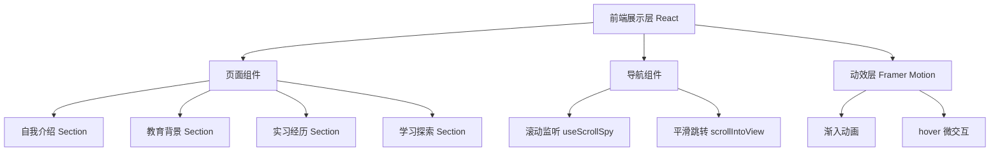

## 1. 架构设计



## 2. 技术说明

- **前端框架**：React@18 + Vite
- **样式方案**：TailwindCSS@3（原子化 CSS，快速实现设计系统）
- **动效库**：Framer Motion（滚动动画、微交互）
- **字体方案**：Google Fonts（Noto Serif SC、Noto Sans SC、Fraunces、Manrope）
- **图标库**：Lucide React（轻量现代图标）
- **初始化工具**：vite-init
- **后端**：无（纯前端静态简历）
- **数据**：简历内容以常量数据形式存储在组件中，便于维护

## 3. 路由定义

| 路由 | 用途 |
|------|------|
| / | 单页应用，包含所有简历章节，通过锚点导航 |

### 3.1 章节锚点

| 锚点 ID | 章节名称 |
|---------|---------|
| #about | 自我介绍 |
| #education | 教育背景 |
| #experience | 实习经历 |
| #learning | 学习探索 |

## 4. 核心交互实现

### 4.1 滚动联动导航（ScrollSpy）

```typescript
// 使用 IntersectionObserver 监听各 section 可见性
// 当 section 进入视口阈值时，高亮对应导航项
const useScrollSpy = (sectionIds: string[]) => {
  const [activeSection, setActiveSection] = useState(sectionIds[0]);
  
  useEffect(() => {
    const observer = new IntersectionObserver(
      (entries) => {
        entries.forEach((entry) => {
          if (entry.isIntersecting) {
            setActiveSection(entry.target.id);
          }
        });
      },
      { rootMargin: '-40% 0px -50% 0px' }
    );
    
    sectionIds.forEach((id) => {
      const element = document.getElementById(id);
      if (element) observer.observe(element);
    });
    
    return () => observer.disconnect();
  }, [sectionIds]);
  
  return activeSection;
};
```

### 4.2 平滑滚动跳转

```typescript
// 点击导航项时平滑滚动到目标 section
const handleNavClick = (sectionId: string) => {
  const element = document.getElementById(sectionId);
  if (element) {
    element.scrollIntoView({ behavior: 'smooth', block: 'start' });
  }
};
```

## 5. 数据模型

### 5.1 简历数据结构

```typescript
interface ResumeData {
  profile: {
    name: string;
    title: string;
    tagline: string;
    avatar: string;
    social: { label: string; url: string; icon: string }[];
    tags: string[];
  };
  education: {
    period: string;
    school: string;
    major: string;
    degree: string;
    gpa: string;
    courses: string[];
    highlights: string[];
  }[];
  experience: {
    period: string;
    company: string;
    role: string;
    description: string;
    achievements: string[];
    skills: string[];
  }[];
  learning: {
    skills: { category: string; items: { name: string; level: number }[] }[];
    projects: { name: string; description: string; tags: string[] }[];
    explorations: string[];
  };
}
```
